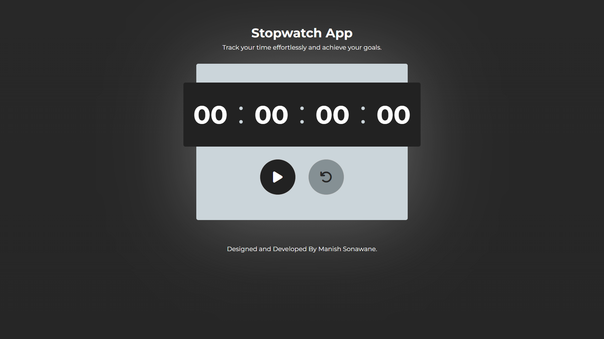

# ⏱️ Stopwatch App  

A simple yet powerful **Stopwatch App** built using **React.js, HTML, CSS, and JavaScript**. It features a sleek and responsive UI, allowing users to start, stop, reset, and record lap times effortlessly.  

---

## 🚀 Features  
✅ **Start / Stop / Reset** stopwatch functionality  
✅ **Lap Time Recording** to track multiple intervals  
✅ **Responsive Design** for all screen sizes  
✅ **Optimized Performance** using React hooks  

---

## 🛠️ Technologies Used  
- **React.js** – Frontend framework  
- **JavaScript (ES6+)** – Logic and event handling  
- **CSS3** – Styling and animations  
- **HTML5** – Markup structure  

---

### Copyright Notice:
**Stopwatch-App**

Copyright © 2025 Manish Sonawane. All rights reserved.

This project, **Stopwatch-App**, is released under the MIT License. Unauthorized use, modification, or distribution of the software or its components is prohibited unless explicitly stated under the terms of the license.

By using or contributing to this project, you agree to comply with the terms and conditions defined in the license. You may use the software for personal, educational, or commercial purposes, provided that proper credit is given to the original authors.

---

### License Information:
This project is licensed under the MIT License. Please refer to the `LICENSE` file in this repository for detailed license information. The terms of the license govern the use, distribution, and modification of the software. If you have any questions regarding the licensing, please contact **manishsonawane3010@gmail.com** (replace with your actual email).

---

### Disclaimer:
The software is provided "as-is" without warranty of any kind, express or implied, including but not limited to the warranties of merchantability, fitness for a particular purpose, and non-infringement. In no event shall the authors or copyright holders be liable for any claim, damages, or other liability, whether in an action of contract, tort, or otherwise, arising from, out of, or in connection with the software or the use or other dealings in the software.

---

### Trademarks:
Any trademarks, service marks, or other marks associated with this project or its components are the property of their respective owners.
